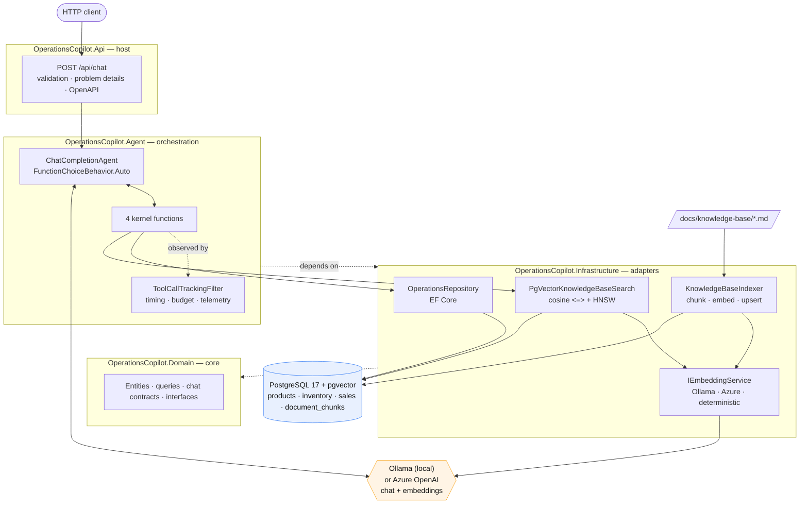
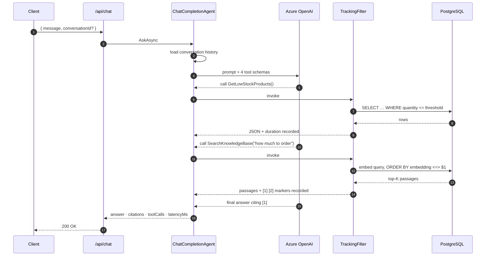
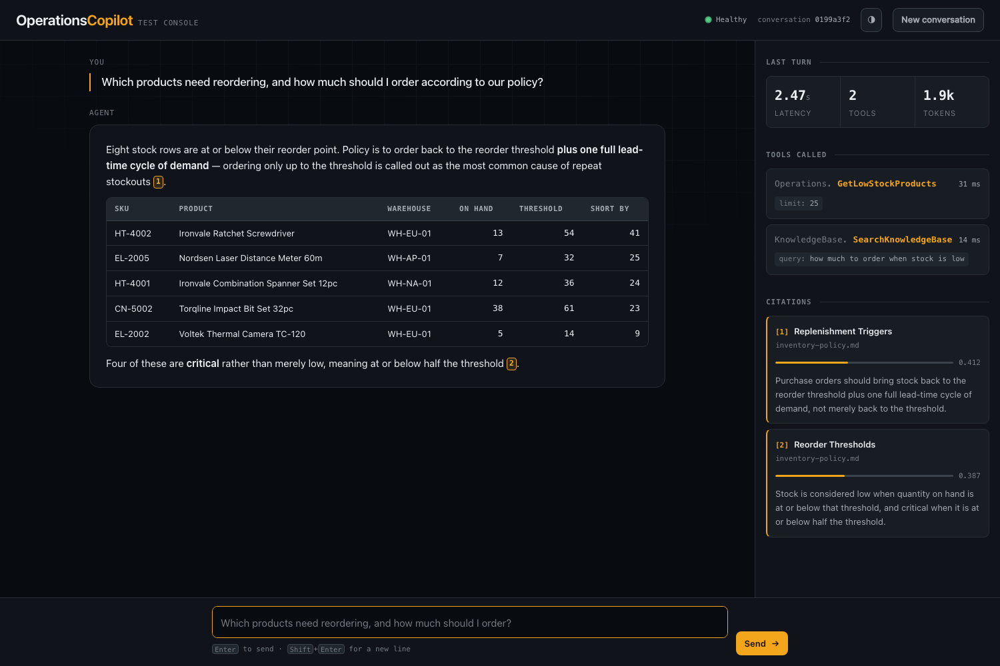

# OperationsCopilot

> **This is a demonstration project, not a product.** It exists to show one clear way to build
> **RAG + a single agent + function calling** on .NET 10, with code you can read end to end in an
> afternoon. The data is invented, the company is fictional, and there is no authentication.
> Read [Limits and caveats](#limits-and-caveats) before lifting anything into production.

An AI copilot for warehouse and sales operations, built as a readable reference implementation.

Ask it a question in plain English. A Semantic Kernel agent decides for itself which tools to
call — live database queries, vector search over company policy documents, or both — and answers
with citations, the tools it used, and how long it took.

Runs on a **local Ollama model** or **Azure OpenAI**, switched by configuration. Chat and
embeddings are chosen independently, so you can keep one local and the other in the cloud.

```
POST /api/chat
{ "message": "Which products need reordering, and how much should I order?" }
```

> The agent answers this by calling `GetLowStockProducts` for the rows **and**
> `SearchKnowledgeBase` for the rule, then applying one to the other. Combining live data with
> written policy in a single turn is the thing this project exists to demonstrate.

[](https://github.com/mecemis/OperationsCopilot/actions/workflows/ci.yml)

---

## Contents

- [What this demonstrates](#what-this-demonstrates)
- [Architecture](#architecture)
- [How a request flows](#how-a-request-flows)
- [The four tools](#the-four-tools)
- [The RAG pipeline](#the-rag-pipeline)
- [Model providers](#model-providers)
- [The test console](#the-test-console)
- [Getting started](#getting-started)
- [Configuration](#configuration)
- [Project layout](#project-layout)
- [Design notes](#design-notes)
- [Limits and caveats](#limits-and-caveats)

**Deeper detail lives in `docs/`:**
[model providers](docs/model-providers.md) ·
[example queries and responses](docs/examples.md) ·
[the evaluation suite](docs/evaluation.md)

---

## What this demonstrates

| Capability | Where to look |
|---|---|
| A single agent that picks its own tools | [`CopilotAgent.cs`](src/OperationsCopilot.Agent/CopilotAgent.cs) |
| Function calling over live business data | [`OperationsPlugin.cs`](src/OperationsCopilot.Agent/Plugins/OperationsPlugin.cs) |
| Swapping local and cloud models by config | [`AiClientFactory.cs`](src/OperationsCopilot.Infrastructure/Ai/AiClientFactory.cs) |
| RAG with pgvector and EF Core | [`PgVectorKnowledgeBaseSearch.cs`](src/OperationsCopilot.Infrastructure/Knowledge/PgVectorKnowledgeBaseSearch.cs) |
| Heading-aware Markdown chunking | [`MarkdownChunker.cs`](src/OperationsCopilot.Infrastructure/Knowledge/MarkdownChunker.cs) |
| Auditable answers: citations, tools, latency | [`ChatResponse.cs`](src/OperationsCopilot.Domain/Chat/ChatResponse.cs) |
| Tool telemetry and a cost ceiling via a filter | [`ToolCallTrackingFilter.cs`](src/OperationsCopilot.Agent/Filters/ToolCallTrackingFilter.cs) |
| Measured retrieval and tool-selection quality | [`tests/OperationsCopilot.EvaluationTests`](tests/OperationsCopilot.EvaluationTests) |
| A browser console for driving it by hand | [`wwwroot/`](src/OperationsCopilot.Api/wwwroot) |

**Stack:** .NET 10 · ASP.NET Core Minimal APIs · Semantic Kernel 1.80 · Ollama or Azure OpenAI ·
PostgreSQL 17 + pgvector · EF Core 10 · Docker Compose · xUnit v3 · GitHub Actions

---

## Architecture

Four layers, each depending only on the one below it. No microservices, no message bus, no CQRS —
the interesting part of this problem is the agent, and everything else stays out of its way.



**Why the agent sits above infrastructure.** The agent orchestrates adapters, so it is the higher
layer. Its plugins depend only on the domain interfaces (`IOperationsRepository`,
`IKnowledgeBaseSearch`), which is what keeps them testable without a database. The reference to
the infrastructure project exists so the agent can ask `AiClientFactory` for a model client —
endpoints, credentials and provider choice stay on the infrastructure side, and the agent only
knows how to wire a client into Semantic Kernel.

---

## How a request flows



Two details worth noting:

- **The model, not the code, decides.** There is no routing logic, no intent classifier, and no
  "if the question mentions stock then…". The kernel is handed four tools with
  `FunctionChoiceBehavior.Auto()` and the model chooses. That is why the tool *descriptions* get
  as much care as the code, and why they are covered by tests.
- **Telemetry comes from a filter, not from the tools.** `ToolCallTrackingFilter` observes every
  invocation, so the `toolCalls` array cannot drift out of step with what actually ran — a tool
  added later is reported automatically.

---

## The four tools

| Tool | Plugin | Backed by | Answers questions like |
|---|---|---|---|
| `GetLowStockProducts` | `Operations` | EF Core | "What's running low?", "What needs reordering in Rotterdam?" |
| `GetSalesSummary` | `Operations` | EF Core | "Revenue last quarter?", "Best selling category?" |
| `GetProductDetails` | `Operations` | EF Core | "Tell me about PT-1001", "How many hard hats do we have?" |
| `SearchKnowledgeBase` | `KnowledgeBase` | pgvector | "What's the returns policy?", "Who approves a 15% discount?" |

Every tool returns JSON, or a plain sentence when there is nothing to return — a bare `[]` invites
the model to go hunting for another tool, whereas "no products are currently below their reorder
threshold" is an answer it can pass straight on.

`GetSalesSummary` accepts either a relative window (`lastDays: 90`) or explicit dates, and groups
by category, product, region, or month. Today's date is injected into the system prompt so the
model can resolve "last quarter" without guessing.

---

## The RAG pipeline

Five Markdown documents in [`docs/knowledge-base/`](docs/knowledge-base) — inventory policy,
supplier management, returns and warranty, pricing and discounts, and the product catalog guide.
They are written to interlock with the seeded database, so questions that need both sources have
consistent answers.

```
docs/knowledge-base/*.md
    │  embedded into the Infrastructure assembly at build time
    ▼
MarkdownChunker            split on ## headings, then on paragraphs near 900 chars,
    │                      with 150 chars of overlap
    ▼
"Title — Heading\n\nbody"  the heading is prepended before embedding, so a chunk that
    │                      says "up to 5%" carries what the 5% is about
    ▼
IEmbeddingService          text-embedding-3-small → 1536 dims
    │
    ▼
document_chunks            vector(1536) + HNSW index (vector_cosine_ops, m=16, ef_construction=64)
    │
    ▼
ORDER BY embedding <=> $1  cosine distance; similarity reported as 1 - distance
```

**Indexing is idempotent.** Each chunk stores a SHA-256 of its text, and unchanged chunks are
skipped — embedding calls are the slow and billable part, so restarting after an unrelated deploy
costs nothing. Current corpus: **29 chunks across 5 documents**.

**The `<=>` operator is written as raw SQL on purpose.** The HNSW index is built on that operator,
and the `ORDER BY` has to name it for PostgreSQL to use the index. Hiding it behind LINQ makes it
easy to write a query that silently degrades into a full table scan.

**Similarity scores are not comparable across models.** The same "how much to order" query
scores about **0.41** against the deterministic provider and **0.73** against
`nomic-embed-text`. That is why `Rag:MinimumScore` is documented as model-specific and why
`ScoreDistributionTests` exists — re-measure after switching, do not carry the number over.

**Citations line up with the answer.** When `SearchKnowledgeBase` returns passages, it hands the
model `[1]`, `[2]` markers and records the same passages in request scope. The `citations` array in
the response uses the identical numbering, so a `[2]` in the prose resolves to citation 2 in the
payload.

---

## The test console

Open <http://localhost:5080> and you get a console for driving the agent by hand.



The chat bubble is the least interesting part. The rail on the right is the point:

- **Last turn** — end-to-end latency, how many tools ran, tokens spent.
- **Tools called** — every invocation in order, with the arguments the *model* chose and each
  call's own duration. A failed tool shows in red with its error.
- **Citations** — each retrieved passage with its similarity score drawn as a meter, because
  `0.412` on its own tells you nothing about whether that was a good match.

Clicking a `[1]` marker in the answer scrolls to and highlights the passage it refers to, which is
the quickest way to check whether a claim is actually supported by the document it cites.

Sample questions are tagged by which sources a correct answer needs — the dashed ones require
both a database tool and the knowledge base, and are the ones worth watching.

It is one HTML file plus two small scripts, with no build step, no framework and no network
dependencies. The Markdown renderer is deliberately hand-written and tiny: the answer is model
output, so it is HTML-escaped first and only then are known-safe structures — tables, lists,
emphasis, citation markers — reintroduced.

Set `Database:InitializeOnStartup` and point the console at a running API and it works against any
environment; there is nothing in it specific to local development.

---

## Model providers

Two settings, chosen independently:

```json
"Ai": {
  "ChatProvider":      "Ollama",   // Ollama | AzureOpenAI
  "EmbeddingProvider": "Ollama"    // Ollama | AzureOpenAI | Deterministic
}
```

Local Ollama by default; Azure OpenAI by configuration. Chat and embeddings switch separately, so
one can be local and the other in the cloud. `Deterministic` is embeddings-only — retrieval has a
usable offline stand-in, deciding which tools to call does not.

Two things will bite you, both covered in **[docs/model-providers.md](docs/model-providers.md)**:

- **The chat model must support tool calling.** qwen2.5, llama3.1, llama3.2 and mistral-nemo do.
- **Embedding dimensions must match the model** (nomic-embed-text is 768, text-embedding-3-small
  is 1536). Switching rebuilds the pgvector column and re-indexes automatically.

There is also a measured note there on why the default is `qwen2.5:14b` and not `7b`: the smaller
model never chains two tools in one turn, so every question needing both live data and a written
rule gets answered from half the evidence.

---

## Getting started

### Prerequisites

- [.NET 10 SDK](https://dotnet.microsoft.com/download)
- Docker (for PostgreSQL, and for the test suite)
- A model provider — **either** [Ollama](https://ollama.com) running locally (the default),
  **or** an Azure OpenAI resource with a chat and an embedding deployment

### Quick start with Docker Compose

```bash
git clone https://github.com/mecemis/OperationsCopilot.git
cd OperationsCopilot

# Pull a tool-calling chat model and an embedding model.
ollama pull qwen2.5:14b
ollama pull nomic-embed-text

cp .env.example .env      # defaults are already set up for local Ollama
docker compose up --build
```

The API container reaches the host's Ollama through `host.docker.internal`, so models stay
managed by the `ollama` CLI rather than baked into the stack.

To use Azure OpenAI instead, set these in `.env` and leave the rest alone:

```bash
AI_CHAT_PROVIDER=AzureOpenAI
AI_EMBEDDING_PROVIDER=AzureOpenAI
AZURE_OPENAI_ENDPOINT=https://<your-resource>.openai.azure.com/
AZURE_OPENAI_API_KEY=<key>          # or leave empty for DefaultAzureCredential
```

On first boot the API applies migrations, seeds the demo data, and indexes the knowledge base.
Watch for:

```
info: Applying database migrations.
warn: Embedding width changed from 1536 to 768. Rebuilding the vector column and clearing the
      knowledge base: vectors from different models cannot be compared, so it will be re-indexed.
info: Embedding column rebuilt as vector(768).
info: Seeded 26 products, 52 inventory rows and 1851 sales lines.
info: Indexed knowledge base: 5 documents, 29 chunks embedded, 0 unchanged.
info: Now listening on: http://[::]:8080
```

That warning on first boot is expected and appears once: the migration creates the column at
1536, and the configured model — `nomic-embed-text` — is 768 wide, so the column is rebuilt to
match. Subsequent starts are silent.

Then:

```bash
curl -s http://localhost:5080/health

curl -s -X POST http://localhost:5080/api/chat \
  -H 'Content-Type: application/json' \
  -d '{"message":"Which products are running low on stock?"}' | jq
```

> **Port note:** Postgres is published on **55433**, not 5432, so the stack does not collide with
> a PostgreSQL already running on your machine. Override with `POSTGRES_PORT` in `.env`.

### Running locally against Dockerised Postgres

```bash
docker compose up -d postgres
dotnet run --project src/OperationsCopilot.Api
```

`appsettings.json` already points at local Ollama, so nothing else is needed. For Azure OpenAI,
put the credentials in user secrets rather than the committed config:

```bash
dotnet user-secrets --project src/OperationsCopilot.Api set "Ai:ChatProvider" "AzureOpenAI"
dotnet user-secrets --project src/OperationsCopilot.Api set "Ai:EmbeddingProvider" "AzureOpenAI"
dotnet user-secrets --project src/OperationsCopilot.Api \
  set "AzureOpenAI:Endpoint" "https://<your-resource>.openai.azure.com/"
dotnet user-secrets --project src/OperationsCopilot.Api set "AzureOpenAI:ApiKey" "<your-key>"
```

The API comes up on <http://localhost:5080>, with interactive API docs at
<http://localhost:5080/scalar> in Development.

Credentials go in [user secrets](https://learn.microsoft.com/aspnet/core/security/app-secrets) or
environment variables — never in `appsettings.json`, which is committed.

### Authenticating with Entra ID instead of a key

Leave `AzureOpenAI:ApiKey` empty and the app uses `DefaultAzureCredential`. Grant your identity the
**Cognitive Services OpenAI User** role on the resource, then `az login`. This is the better option
outside local development.

### Running with no model at all

Set `Ai:EmbeddingProvider` to `Deterministic` and retrieval runs entirely in process, using
hashed bag-of-words vectors — no model, no network, no cost. Indexing, vector search, the
database tools and the whole test suite work this way.

It matches on shared vocabulary rather than on meaning, so it is a development and testing aid,
not a substitute for a real embedding model. **Answering questions still requires a chat model**,
because nothing local can decide which tools to call.

### Running the tests

```bash
dotnet test
```

The evaluation suite starts a real PostgreSQL with pgvector through Testcontainers, so Docker must
be running. No Azure subscription is needed; the four live-model tests skip themselves.

```
Passed!  - Failed: 0, Passed: 44, Skipped: 0, Total: 44   OperationsCopilot.UnitTests
Passed!  - Failed: 0, Passed: 51, Skipped: 4, Total: 55   OperationsCopilot.EvaluationTests
```

The live-model tier runs automatically when a provider is available — Ollama counts, so on a
machine with `qwen2.5:14b` pulled it simply runs:

```bash
dotnet test --filter "Category=LiveModel"
```

It prefers Azure OpenAI when `AZURE_OPENAI_ENDPOINT` is set, otherwise falls back to Ollama, and
skips when neither is reachable.

### Working with migrations

```bash
dotnet tool restore

export OPERATIONSDB_CONNECTION="Host=localhost;Port=55433;Database=operationscopilot;Username=postgres;Password=postgres"

dotnet ef migrations add <Name> \
  --project src/OperationsCopilot.Infrastructure \
  --startup-project src/OperationsCopilot.Infrastructure \
  --output-dir Persistence/Migrations
```

---

## Configuration

Bound from `appsettings.json`, environment variables (`Section__Key`), and user secrets.

| Setting | Default | Notes |
|---|---|---|
| `ConnectionStrings:OperationsDb` | `…Port=55433…` | PostgreSQL connection string |
| `Ai:ChatProvider` | `Ollama` | `Ollama` or `AzureOpenAI`. `Deterministic` is rejected |
| `Ai:EmbeddingProvider` | `Ollama` | `Ollama`, `AzureOpenAI` or `Deterministic` |
| `Ollama:Endpoint` | `http://localhost:11434/v1` | Note the `/v1` — the OpenAI-compatible API |
| `Ollama:ChatModel` | `qwen2.5:14b` | **Must support tool calling** |
| `Ollama:EmbeddingModel` | `nomic-embed-text` | |
| `Ollama:EmbeddingDimensions` | `768` | Must match the model exactly |
| `AzureOpenAI:Endpoint` | *(empty)* | Required when a provider is `AzureOpenAI` |
| `AzureOpenAI:ApiKey` | *(empty)* | Empty ⇒ `DefaultAzureCredential` |
| `AzureOpenAI:ChatDeployment` | `gpt-4o-mini` | Deployment name, not model name |
| `AzureOpenAI:EmbeddingDeployment` | `text-embedding-3-small` | |
| `AzureOpenAI:EmbeddingDimensions` | `1536` | Must match the deployment exactly |
| `Rag:TopK` | `5` | Passages per search |
| `Rag:MinimumScore` | `0.15` | Cosine floor — **see below** |
| `Rag:MaxChunkCharacters` | `900` | Chunk size target |
| `Rag:ChunkOverlapCharacters` | `150` | Overlap between chunks |
| `Rag:IndexOnStartup` | `true` | Idempotent; skips unchanged chunks |
| `Agent:Temperature` | `0.1` | Low: this agent reports figures |
| `Agent:MaxOutputTokens` | `1200` | |
| `Agent:MaxToolCallsPerTurn` | `8` | Enforced by the tracking filter |
| `Agent:AdditionalInstructions` | *(empty)* | Appended to the system prompt |
| `Database:InitializeOnStartup` | `true` | Set `false` to migrate from a pipeline |

**About `Rag:MinimumScore`.** This is the setting most likely to be picked out of the air and then
quietly break retrieval: set it too high and every search returns nothing, which reads to the user
like an empty knowledge base. The default was chosen from measurement, not intuition — across the
evaluation query set, relevant passages score from about **0.22** upward while off-topic questions
peak around **0.11**, so **0.15** separates them with margin on both sides. It is specific to one
embedding model — re-measure with `ScoreDistributionTests` after switching provider or model,
because the scale of cosine scores differs between them.

---

## Examples and evaluation

- **[docs/examples.md](docs/examples.md)** — worked requests and full JSON responses: database
  only, knowledge base only, both combined, and a follow-up turn.
- **[docs/evaluation.md](docs/evaluation.md)** — the two-tier evaluation suite. The offline tier
  runs free and deterministic on every commit (measured MRR 0.922, recall@5 0.967 over a 15-query
  golden set); the live tier measures how a real model actually selects tools.

---

## Project layout

```
OperationsCopilot/
├── src/
│   ├── OperationsCopilot.Domain/            entities, query contracts, chat contracts, interfaces
│   │   ├── Abstractions/                    IOperationsRepository, IKnowledgeBaseSearch, ICopilotAgent…
│   │   ├── Catalog/                         Product, InventoryItem, Sale + query and result records
│   │   ├── Chat/                            ChatRequest, ChatResponse, Citation, ToolInvocation
│   │   └── Knowledge/                       DocumentChunk, KnowledgeSearchResult
│   │
│   ├── OperationsCopilot.Infrastructure/    adapters — nothing here knows about the agent
│   │   ├── Ai/                              provider selection: Ollama, Azure OpenAI, clients
│   │   ├── Conversations/                   in-memory conversation history
│   │   ├── Embeddings/                      generator-backed + deterministic offline provider
│   │   ├── Knowledge/                       chunker, indexer, pgvector search, embedded doc source
│   │   ├── Options/                         AzureOpenAIOptions, RagOptions
│   │   ├── Persistence/                     DbContext, configurations, migrations, repository,
│   │   │                                    vector column width sync
│   │   └── Seeding/                         the fixed demo dataset
│   │
│   ├── OperationsCopilot.Agent/             the Semantic Kernel layer
│   │   ├── Filters/                         ToolCallTrackingFilter
│   │   ├── Options/                         CopilotAgentOptions
│   │   ├── Plugins/                         the four tools + tool-name constants
│   │   ├── CopilotAgent.cs                  assembles the turn, builds the auditable response
│   │   └── CopilotSystemPrompt.cs           the instructions, versioned as code
│   │
│   └── OperationsCopilot.Api/               minimal API host
│       ├── Endpoints/                       POST /api/chat, startup database initialization
│       ├── wwwroot/                         the test console — one page, no build step
│       └── Program.cs                       composition root
│
├── tests/
│   ├── OperationsCopilot.TestSupport/       Testcontainers fixture, scripted chat model
│   ├── OperationsCopilot.UnitTests/         44 tests, no I/O
│   └── OperationsCopilot.EvaluationTests/   55 tests, real PostgreSQL
│
├── docs/knowledge-base/                     the five policy documents
├── .github/workflows/ci.yml
├── docker-compose.yml
└── Directory.Packages.props                 central package versions
```

---

## Design notes

**The system prompt is code, not configuration.** It lives in
[`CopilotSystemPrompt.cs`](src/OperationsCopilot.Agent/CopilotSystemPrompt.cs), is reviewed like
code, and changes behaviour as surely as code does. `Agent:AdditionalInstructions` exists for
deployment-specific rules without forking it.

**Tool descriptions are load-bearing.** The model sees names, descriptions, and parameter
descriptions and nothing else. `ToolCatalogueEvaluationTests` enforces a minimum substance for
each, that filter parameters stay optional (so "what's running low?" works without an invented
warehouse code), and that descriptions name concrete values like `WH-EU-01` and `EMEA`.

**The domain has no database types.** `DocumentChunk.Embedding` is `float[]`, converted to
pgvector's `Vector` in the EF configuration. The `Pgvector` package depends on Npgsql, and dragging
the PostgreSQL driver into the domain project to save one value converter is a bad trade.

**Ollama goes through the OpenAI connector, not a dedicated one.** Ollama exposes an
OpenAI-compatible API at `/v1` that returns proper `tool_calls`, so pointing
`OpenAIChatCompletionService` at it gives automatic function calling on exactly the same code
path as Azure. A dedicated Ollama connector would be a second path with its own tool-calling
quirks to discover — this way, if function calling works on one provider it works on both.

**The vector column's width is managed at run time, not by a migration.** Embedding width is only
known from configuration, and EF migrations are static. `VectorSchema` reconciles the two on
startup and is a no-op unless the configured model changed. It is the one place where the schema
is deliberately not owned by migrations, and the comment there says why.

**The tool-call budget is enforced, not advertised.** `Agent:MaxToolCallsPerTurn` is applied by the
tracking filter, which short-circuits further calls with a message telling the model to answer from
what it has. The user still gets a reply instead of a hung request or an error.

**Three things this suite caught while it was being written**, all worth knowing about:

1. EF Core cannot translate aggregate projections into a *positional record constructor* once the
   query joins to another table. `GetSalesSummary` threw at runtime for every grouped query.
   Projecting to an anonymous type and mapping afterwards keeps it a single SQL statement.
2. `Rag:MinimumScore` was set to `0.25` by intuition. Measurement showed genuinely relevant
   passages scoring as low as `0.225`, so real questions were being answered with "the knowledge
   base contains no relevant passage". It is now `0.15`, chosen from the measured gap between
   on-topic and off-topic scores.
3. Small local models do not chain tools. See
   [model capability](docs/model-providers.md#model-capability-and-combined-questions) — the live tier surfaced this
   immediately, and it is invisible to every other kind of test.

---

## Limits and caveats

This is a demonstration project. Where it would differ from something you could deploy:

- **Migrations run at startup.** Convenient for `docker compose up`; wrong for a real deployment,
  where schema changes should be gated in a release pipeline. Set
  `Database:InitializeOnStartup=false` and run `dotnet ef database update` from CD.
- **Conversation history is in process memory.** Behind a load balancer this needs sticky sessions
  or a distributed store. `IConversationStore` is the seam.
- **There is no authentication.** Add authentication and authorization before exposing this; the
  tools read real business data, and both `/api/chat` and the test console at `/` are
  unauthenticated as written. A real deployment would put the console behind the same auth as the
  API, or not ship it at all.
- **There is no rate limiting or per-user cost cap.** `Agent:MaxToolCallsPerTurn` bounds one turn;
  it does not bound a user making a thousand of them. Add ASP.NET Core rate limiting and track
  spend per caller.
- **Answers are not guarded beyond the prompt.** The prompt tells the agent to answer only from
  tools and to decline out-of-scope questions, and the live tier tests that. A prompt is not a
  security control — add output filtering if answers reach customers.
- **The deterministic embedding provider is a development aid.** It matches vocabulary, not
  meaning. Do not ship it.
- **Model capability is not uniform.** Tool selection, and especially chaining two tools in one
  turn, varies a lot by model. Run the live tier against whatever you intend to deploy rather
  than assuming the numbers here transfer.
- **Retrieval is single-stage.** No reranking, no hybrid keyword+vector search, no query rewriting.
  All three are worth adding for a larger corpus; at 29 chunks they would be ceremony.

---

## License

MIT — see [LICENSE](LICENSE).
